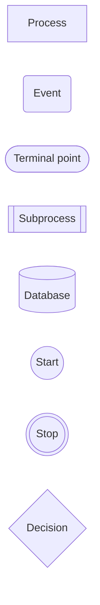

# Mermaid

[Mermaid](https://mermaid.js.org)

<style>
  .keyword {
    color: Violet;
  }
  .enum {
    color: Orange;
  }
  .declare {
    color: Cyan;
  }
</style>

<pre>
```mermaid
<font class='declare'>Diagram Syntax</font>
```
</pre>

## 流程图

> 流程图节点中不能使用 `end`.

### 节点

<pre>
<font class='keyword'>flowchart</font> LR
    <font class='declare'>id</font>
</pre>


### 带文本的节点

<pre>
flowchart LR
    <font class='declare'>id[这是带文本的节点]</font>
</pre>


### 方向

<pre>
flowchart <font class='enum'>LR</font>
    Start --> End
</pre>


流程图的方向:

- `TB`/`TD` - 从上到下
- `BT` - 从下到上
- `LR` - 从左到右
- `RL` - 从右到左

### 节点形状

<pre>
flowchart LR
    id1[Process]
    id2(Event)
    id3([Terminal point])
    id4[[Subprocess]]
    id5[(Database)]
    id6((Start))
    id7(((Stop)))
    id8{Decision}
</pre>



> 更多形状见 [Mermaid](https://mermaid.js.org).

### 节点之间的链接

<pre>
flowchart LR
    A --> B
    C -->|text| D
    E --- F
    G -.-> H
    I ==> J
    K ~~~ L
    M --> N --> O
    P --> Q & R --> S
</pre>


### 新的箭头类型

<pre>
flowchart LR
    A --o B
    C --x D
</pre>


### 多方向箭头

<pre>
flowchart LR
    A <--> B
    B o--o C
    C x--x D
</pre>


#### 链接的最小长度

<pre>
flowchart LR
    A --> B
    C ---> D
</pre>


| 长度      | 1      | 2       | 3        |
| -------- | ------ | ------- | -------- |
| 实线      | `---`  | `----`  | `-----`  |
| 实线带箭头 | `-->`  | `--->`  | `---->`  |
| 粗线      | `===`  | `====`  | `=====`  |
| 粗线带箭头 | `==>`  | `===>`  | `====>`  |
| 虚线      | `-.-`  | `-..-`  | `-...-`  |
| 虚线带箭头 | `-.->` | `-..->` | `-...->` |

### 子图

<pre>
flowchart LR
    <font class='keyword'>subgraph</font> F1 [one]
        A --> B
    <font class='keyword'>end</font>
    subgraph two
        C --> D
    end
    A --> C
    B --> two
    F1 --> two
</pre>


#### 子图的方向

<pre>
flowchart LR
    subgraph one
        <font class='keyword'>direction</font> TB
        T1[top] --> B1[bottom]
    end
    subgraph two
        <font class='keyword'>direction</font> TB
        T2[top] --> B2[bottom]
    end
    outside --> one
    outside --> T2
</pre>


> 如果任何子图的节点链接到外部, 则子图方向将被忽略, 子图将继承父图的方向.

## 时序图

<pre>
<font class='keyword'>sequenceDiagram</font>
    Alice ->> John: Hello John, how are you?
    John -->> Alice: Great!
    Alice -) John: See you later!
</pre>


### 语法

#### 参与者

<pre>
sequenceDiagram
    <font class='keyword'>participant</font> Alice
    participant Bob
    Bob ->> Alice: Hi Alice
    Alice ->> Bob: Hi Bob
</pre>


#### 别名

<pre>
sequenceDiagram
    participant A <font class='keyword'>as</font> Alice
    participant J as John
    A ->> J: Hello John, how are you?
    J ->> A: Great!
</pre>


#### 分组

<pre>
sequenceDiagram
    <font class='keyword'>box</font> <font class='enum'>Gray</font> Alice & John
    participant A
    participant J
    <font class='keyword'>end</font>
    box <font class='enum'>transparent</font> Aqua
    participant B
    participant C
    end
    A ->> J: Hello John, how are you?
    J ->> A: Great!
    A ->> B: Hello Bob, how is Charley?
    B ->> C: Hello Charley, how are you?
</pre>


### 信息

<pre>
[Actor][Arrow][Actor]:Message text
</pre>

目前支持十种类型的箭头:

| 类型      | 描述           |
| -------- | ------------- |
| `->`     | 没有箭头的实线   |
| `-->`    | 没有箭头的虚线   |
| `->>`    | 带箭头的实线    |
| `-->>`   | 带箭头的虚线    |
| `<<->>`  | 带双向箭头的实线 |
| `<<-->>` | 带双向箭头的虚线 |
| `-x`     | 带十字箭头的实线 |
| `--x`    | 带十字箭头的虚线 |
| `-)`     | 带空心箭头的实线 |
| `--)`    | 带空心箭头的虚线 |

### 激活

<pre>
sequenceDiagram
    Alice ->> John: Hello John, how are you?
    <font class='keyword'>activate</font> John
    John -->> Alice: Great!
    <font class='keyword'>deactivate</font> John
</pre>


还有一种快捷表示法, 即在消息箭头后附加 `+`/`-` 后缀:

<pre>
sequenceDiagram
    Alice ->> <font class='declare'>+</font> John: Hello John, how are you?
    John -->> <font class='declare'>-</font> Alice: Great!
</pre>


同一角色的激活可以叠加:

<pre>
sequenceDiagram
    Alice ->> + John: Hello John, how are you?
    Alice ->> + John: John, can you hear me?
    John -->> - Alice: Hi Alice, I can hear you!
    John -->> - Alice: I feel great!
</pre>


### 注意

<pre>
<font class='keyword'>Note</font> [<font class='enum'>right of | left of | over</font>] [Actor]: Text in note content
</pre>

<pre>
sequenceDiagram
    participant Alice
    participant John
    participant Bob
    Alice -> John: Hello John, how are you?
    Note over Alice,John: A typical interaction
    Note right of Bob: Text in note
</pre>


### 换行符

<pre>
sequenceDiagram
    Alice -> John: Hello John,&lt;br/>how are you?
    Note over Alice,John: A typical interaction&lt;br/>But now in two lines
</pre>


### 循环

<pre>
sequenceDiagram
    Alice -> John: Hello John, how are you?
    <font class='keyword'>loop</font> Every minute
        John --> Alice: Great!
    <font class='keyword'>end</font>
</pre>

```mermaid
sequenceDiagram
    Alice -> John: Hello John, how are you?
    loop Every minute
        John --> Alice: Great!
    end
```

### 替代

<pre>
sequenceDiagram
    Alice ->> Bob: Hello Bob, how are you?
    <font class='keyword'>alt</font> is sick
        Bob ->> Alice: Not so good :(
    <font class='keyword'>else</font> is well
        Bob ->> Alice: Feeling fresh like a daisy
    <font class='keyword'>end</font>
    <font class='keyword'>opt</font> Extra response
        Bob ->> Alice: Thanks for asking
    <font class='keyword'>end</font>
</pre>

```mermaid
sequenceDiagram
    Alice ->> Bob: Hello Bob, how are you?
    alt is sick
        Bob ->> Alice: Not so good :(
    else is well
        Bob ->> Alice: Feeling fresh like a daisy
    end
    opt Extra response
        Bob ->> Alice: Thanks for asking
    end
```

### 序列号

<pre>
sequenceDiagram
    <font class='keyword'>autonumber</font>
    Alice ->> John: Hello John, how are you?
    John -->> Alice: Great!
    John ->> Bob: How about you?
    Bob -->> John: Jolly good!
</pre>

```mermaid
sequenceDiagram
    autonumber
    Alice ->> John: Hello John, how are you?
    John -->> Alice: Great!
    John ->> Bob: How about you?
    Bob -->> John: Jolly good!
```

## 类图

## 状态图

---

推荐工具: Visual Studio Code

推荐扩展:

- Markdown All in One
- Mermaid Markdown Syntax Support
